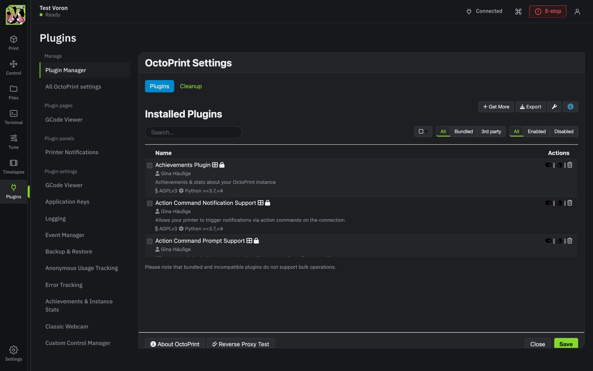

# MakerPrint UI for OctoPrint

A replacement interface for **OctoPrint + Klipper**, made for a Voron and styled after the MakerPrint logo. It takes over OctoPrint's main page; the classic interface stays one click away (or add `?classic` to the address).

Works with OctoPrint 1.9 and newer (developed against 1.11) on Python 3.7+. There is nothing else to install: no Node, no build step, no extra Python packages.


## Screens

**Print**
- The job: thumbnail, progress by layer (read from the G-code itself, so any slicer works), elapsed and remaining time, finish time, height and filament used.
- A 3D preview of the file's toolpath.
- The camera, with snapshot and full screen. The stream pauses while the tab is hidden.
- Temperatures: nozzle, bed and chamber with editable targets, a history chart and material presets.
- Live tuning: speed, flow, fans and Z baby-steps, with *Save to probe* (`Z_OFFSET_APPLY_PROBE`).
- Cancel needs a press-and-hold, and an optional checklist runs before each print.

**Control**: jog pad (arrow keys and PgUp/PgDn work), click-to-move bed map, extruder with a cold-extrusion guard, macros, fans and LED colours.

**Files**: thumbnails from PrusaSlicer, OrcaSlicer, SuperSlicer and Bambu Studio, slicer estimates, print history, folders, search, bulk actions, and drag-and-drop upload on any page.

**Terminal**: Klipper-aware colouring, timestamps, filters, search, history, and autocomplete built from your printer's own `HELP` output, so your macros complete too.

**Tune**: quad gantry level and Z tilt results, probe accuracy, the paper test, a bed mesh heat map with profiles, PID tuning, pressure advance, input shaper results with a ready-to-paste `[input_shaper]` block, heat soak, calculators, usage statistics and maintenance reminders based on real print hours.

**Plugins**: OctoPrint's Plugin Manager (also under Settings), plus every installed plugin's own tabs, sidebar panels and settings pages. A Plugins panel on the Print page shows all plugin sidebar panels at once, in both looks. They run in OctoPrint's classic page inside MakerPrint, so they work exactly as they do in the classic interface.

**Two looks** (Settings > Appearance): *MakerPrint*, dark graphite with the logo colours and the essentials on the Print page, and *Studio*, a light black-white-and-grey workspace with a top navigation bar and every panel on the Print page: toolhead position and moves, a console, all macros, Klipper state and last calibration results, the host computer (storage, Pi power, restart and shutdown) and usage. **Settings > Print page** picks the panels and their order for each look.

**Printing**: a live view of the current layer from above, the print's pace compared with the slicer's estimate, and *Pause at layer* (or a filament change with M600), watched by the printer's computer so it works with every browser closed.

**Spools**: a list of your spools, or a Spoolman server. Pick the spool before a print; the filament it uses comes off that spool when it ends, with a warning when the material doesn't match or there isn't enough left.

**Queue**: line files up on the Files screen and start the next one with one click, after confirming the bed is clear.

**Camera**: more than one camera, a small camera view on every screen, and a time-lapse of the current print from pictures saved every 20 seconds. Notifications can carry a camera picture (Discord and ntfy), and there's a *first layer done* notification so you can check the first layer from your phone.

**Updates** (Settings > Updates) always checks fresh and installs updates for this plugin, OctoPrint and other plugins, with the log shown as it runs. **Settings > OctoPrint settings** opens OctoPrint's full settings dialog without leaving MakerPrint.

Also: timelapses, four colour themes, a command palette (`Ctrl/Cmd+K`), a kiosk mode for a screen at the printer, and push notifications (ntfy, Discord, Slack or any URL) sent by the printer itself, so they arrive with every browser closed.

**Macro prompts**: when a Klipper macro asks a question it appears as a dialog on every open screen. It uses Mainsail's `action:prompt_*` format, so macros written for Mainsail work unchanged. Marlin-style `M876` prompts and `action:notification` messages are shown too.


| | |
|---|---|
|  |  |
| 3D preview | Tune |
|  |  |
| Control | Files |
|  |  |
| Terminal | Kiosk |
|  |  |
| Voron theme | Settings |




## A Claude button (optional, per browser)

**Settings > Appearance > Claude button** adds a Claude button at the bottom of the side bar. It opens claude.ai (Claude Code or a chat) in a window docked beside the printer page, with your own claude.ai sign-in, chats and sessions. claude.ai can't be shown inside another site's page (it forbids framing), so a docked window is as close to built-in as browsers allow. The setting is stored in that browser only, so it's off for everyone else who uses the plugin.

## Install

In OctoPrint go to **Settings > Plugin Manager > Get More > ... from URL**, paste

```
https://github.com/28kearlrusa-spec/Octoprint/archive/refs/heads/main.zip
```

and click **Install**. Restart OctoPrint when asked, then open your printer's address as usual.

Updates appear in OctoPrint's **Software Update** like any other plugin, from this repository's releases.

### Getting the classic interface back

- Add `?classic` to the address, for example `http://your-printer/?classic`.
- Or use *Classic OctoPrint UI* in the account menu.
- Or, in the classic Settings dialog, untick **MakerPrint UI > Use the MakerPrint UI as the main page**.

## Using it away from home

Don't forward a port on your router to OctoPrint: anything that can reach it can try to log in, and OctoPrint's own advice is never to expose it to the internet. A private network is the safe way, and [Tailscale](https://tailscale.com) is free for personal use:

1. On the printer's computer (over SSH):
   ```bash
   curl -fsSL https://tailscale.com/install.sh | sh
   sudo tailscale up --accept-dns=false
   ```
   Open the link it prints and sign in.
2. Optional, for a secure `https://` address with a real certificate:
   ```bash
   sudo tailscale serve --bg 80
   ```
   If it asks you to enable HTTPS for your tailnet, follow the link it prints, then run the command again. `tailscale serve status` shows the address.
3. Install the Tailscale app on your phone and laptop and sign in with the same account. The printer then works from anywhere, and nothing is opened to the internet.

## Security

- Every page of the app carries a strict content security policy: only the plugin's own scripts can run, so injected markup can't run code.
- Every API route checks OctoPrint's own permissions. Signed-out visitors get the sign-in screen, and it shows nothing about your server.
- Accounts with two-factor sign-in (OctoPrint 1.11 and a 2FA plugin) are handed to OctoPrint's own code entry and come straight back.
- File paths are checked to stay inside OctoPrint's uploads folder, and webhook addresses are visible to admins only.
- Everything the interface sends to the printer goes through OctoPrint's normal API. Its background queries (`M115`, `STATUS`, `HELP` after connecting) are hidden from the terminal by default and shown with *Show background*.

## Klipper tips

- **Connecting**: with OctoKlipper the port is usually `/tmp/printer`. After connecting, the interface sends `M115`, `STATUS` and `HELP` (hidden from the terminal) to learn which commands your config has, and dims macros and tools that won't work.
- **Chamber temperature**: OctoPrint only sees sensors Klipper reports in `M105`. Add `gcode_id: C` to your `[temperature_sensor chamber]`.
- **Macro prompts** need `[respond]` in `printer.cfg`. For example:
  ```
  RESPOND TYPE=command MSG="action:prompt_begin Filament runout"
  RESPOND TYPE=command MSG="action:prompt_text Load new filament, then resume."
  RESPOND TYPE=command MSG="action:prompt_footer_button Cancel print|CANCEL_PRINT|error"
  RESPOND TYPE=command MSG="action:prompt_footer_button Resume|RESUME|primary"
  RESPOND TYPE=command MSG="action:prompt_show"
  ```
  The macro that handles the answer closes it with `RESPOND TYPE=command MSG="action:prompt_end"`. Closing the dialog sends the same line.
- **Shutdowns**: when Klipper stops (lost MCU, heater fault) a red bar appears on every screen with the reason and a *Firmware restart* button, and the serial link reconnects afterwards.
- Macros it knows about, all optional: `QUAD_GANTRY_LEVEL`, `Z_TILT_ADJUST`, `BED_MESH_CALIBRATE`, `CLEAN_NOZZLE`, `LOAD_FILAMENT`, `UNLOAD_FILAMENT`, and Klipper's built-ins.

## Development

```bash
dev/dev-instance.sh setup     # a virtualenv with OctoPrint, this plugin and a throwaway user
dev/dev-instance.sh bg        # http://127.0.0.1:5055 with OctoPrint's virtual printer
dev/fixture.sh connect        # connect the virtual printer
python3 dev/make_samples.py   # sample G-code with thumbnails
node dev/screenshots.mjs      # regenerate docs/screenshots (needs Chrome)
```

Set `MF_SANDBOX` to keep the sandbox somewhere other than `~/.makerforge-dev`. On macOS port 5000 belongs to AirPlay, so the scripts use 5055.

Tests:

```bash
python3 -m unittest discover -s tests -v   # G-code metadata, layer scan, stores, notifications
node tests/klipper.test.mjs                # Klipper output parsers, using Klipper's own message formats
node tests/prompts.test.mjs                # macro prompts
node tests/worker.test.mjs                 # the toolpath parser
```

The front end is plain ES modules loaded through an import map with content-hashed URLs, so there is no build step and updates never get stuck in a browser cache. The layer scan runs as a separate low-priority process so it can't slow Klipper down on a Raspberry Pi. Settings and statistics live in OctoPrint's plugin data folder.

## Credits

Fonts: IBM Plex Sans and IBM Plex Mono, under the SIL Open Font License 1.1 (`octoprint_makerforge/static/fonts/OFL.txt`). Logo and colours: MakerPrint. The camera image in the screenshots is a photo by Jakub Zerdzicki on Pexels. Built on [OctoPrint](https://octoprint.org).

Licensed AGPLv3, like OctoPrint itself.
