# MakerForge UI for OctoPrint

A complete, custom control surface for **OctoPrint + Klipper**, built for Voron-class printers and dressed in the MakerForge look: near-black machined surfaces, lime and pink from the logo, cut corners like a printed Voron part, and a status LED that tells you what the machine is doing from across the room.

It replaces OctoPrint's main page (the classic UI is always one click, or `?classic`, away) and adds a small JSON API for the things OctoPrint doesn't do itself, like G-code thumbnails and per-layer progress.

> Works with OctoPrint 1.9 and newer (developed and tested against 1.11) on Python 3.7+. Nothing to install besides the plugin itself: no Node, no build step, no extra Python packages.

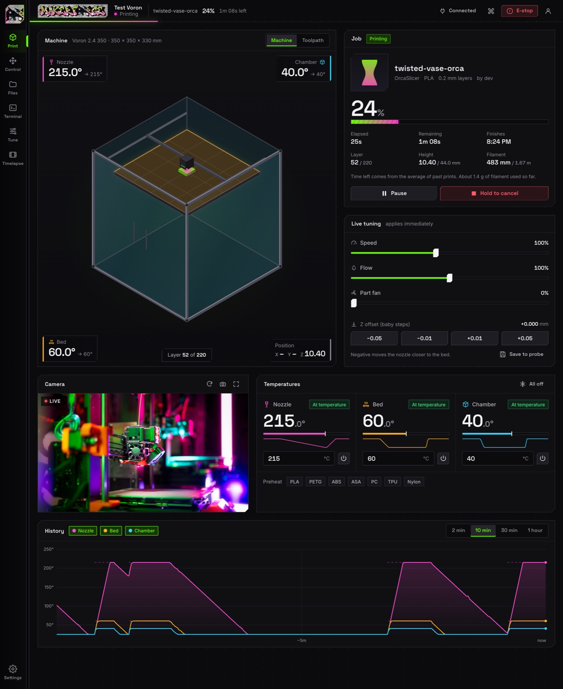

## What you get

**Print** is the dashboard.
- A live isometric schematic of your printer: the bed glows with its temperature and drops as Z climbs (Voron 2.4, Trident and 0.x move the bed), the part grows on it, the toolhead LED shows status, and a chamber tint shows the enclosure warming up.
- Job readout with real **layer x / y**, elapsed, remaining and finish time, height, and filament used so far, from a layer map built off the G-code itself, so it works with any slicer.
- Nozzle, bed and chamber tiles with editable targets, sparklines and material presets. A history chart with hover read-out. Camera with snapshot, full screen and automatic pause when the tab is hidden.
- Live tuning: speed, flow, part fan, extra fans (Nevermore, exhaust) and Z baby-stepping with a "save to probe" that stages `Z_OFFSET_APPLY_PROBE`.
- A **Toolpath** tab: the file being printed in 3D (WebGL), coloured by progress, layer, speed or feature type, with the live nozzle position and a layer scrubber.
- Hold-to-confirm on Cancel, and a **before you print** checklist you can edit or switch off.

**Control** has a big jog pad (arrow keys and PgUp/PgDn work too), a click-to-move bed map that must be armed first, extruder feed with cold-extrusion protection, macros, fans and toolhead LED colours.

**Files** shows thumbnails read from PrusaSlicer, OrcaSlicer, SuperSlicer and Bambu Studio G-code, slicer estimates, filament, and print history. Folders, search, sort, bulk move and delete, and drag-and-drop upload anywhere on any page.

**Terminal** is colour-coded for Klipper (`//` info, `!!` errors), has timestamps, filters, search, history, and **autocomplete built from Klipper's own `HELP` output**, so your macros complete too.

**Tune** is the Klipper and Voron toolbox:
- Quad gantry level / Z tilt with the last result parsed into range, tolerance and retries
- Probe accuracy, and a guided paper-test Z offset (`PROBE_CALIBRATE`, `TESTZ`, `ACCEPT`)
- Bed mesh heat map read from `BED_MESH_OUTPUT`, with profiles
- PID tuning, pressure advance tower helper and calculator, input shaper calibration with a results table and a ready-to-paste `[input_shaper]`, motion limits, chamber heat soak timer
- Rotation distance, flow and volumetric flow calculators
- Usage stats and **maintenance reminders** counted from real print hours (rails, nozzle, belts, fans)

**Timelapse**, **Settings** (four themes, macros, presets, camera, notifications), a **command palette** (`Ctrl/Cmd+K`), and a **kiosk mode** for a wall-mounted screen.

**Macro prompts**: when a Klipper macro asks a question (filament runout, heat soak, nozzle wipe), it pops up on every screen, the kiosk included. It speaks the same `action:prompt_*` protocol as Mainsail, so macros written for Mainsail work unchanged. Marlin-style host prompts (answered with `M876`) and `action:notification` messages show up too.

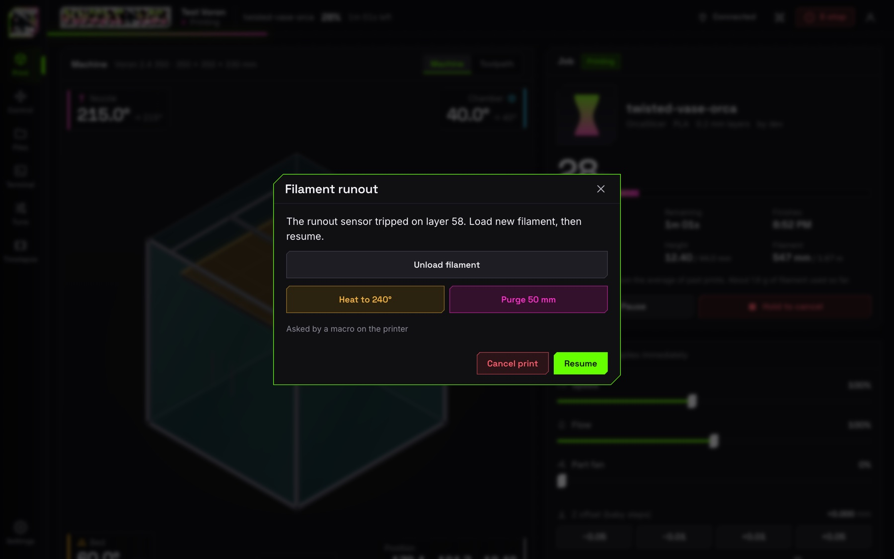

**Notifications** go out from the printer itself, so they work with every browser closed: ntfy (phone push), Discord, Slack or any URL.

Everything honest: stats and history only record real events, and nothing is shown that the printer didn't tell us.

## Screenshots

| | |
|---|---|
| 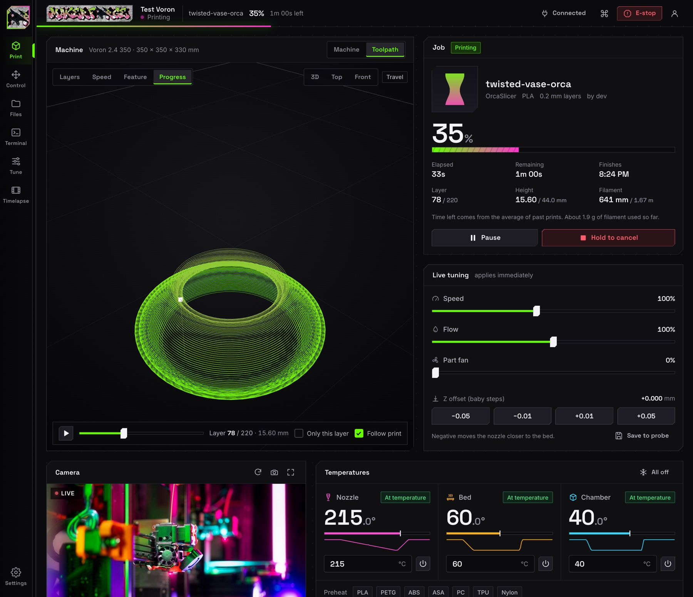 | 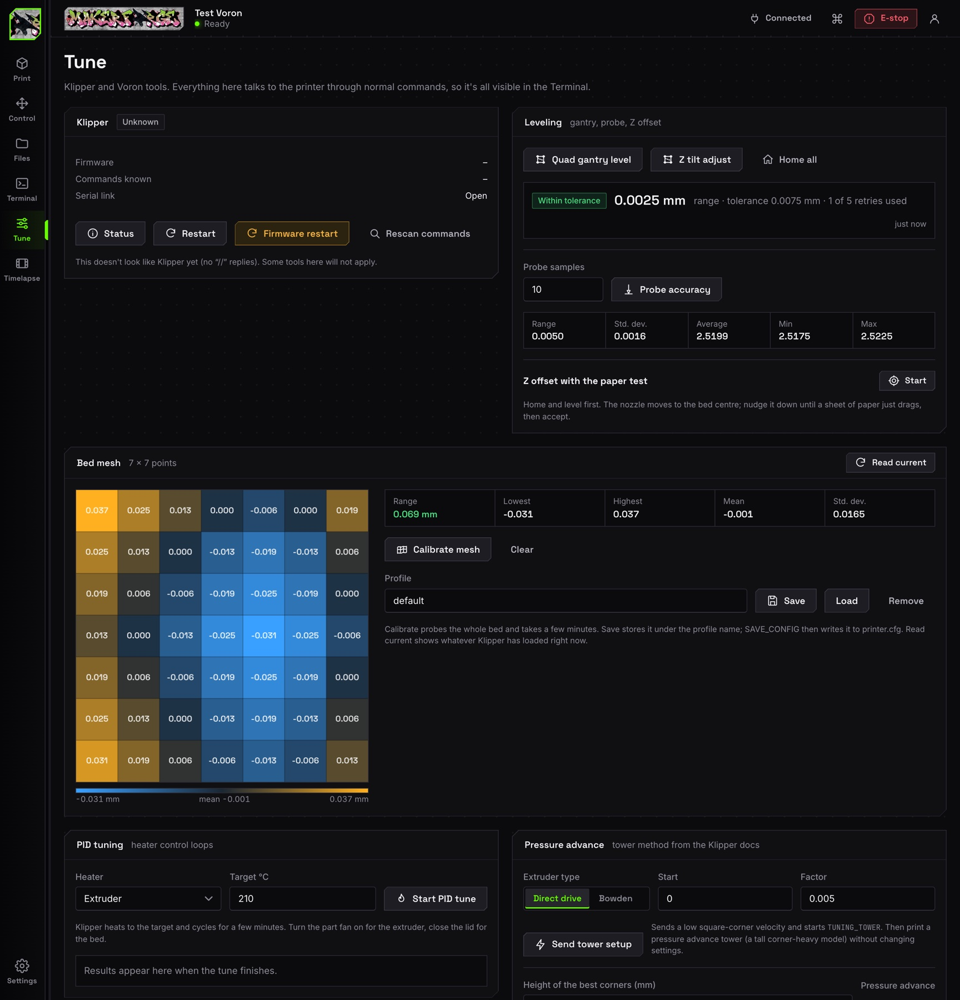 |
| **Toolpath**: the running file in 3D, following the nozzle | **Tune**: QGL, probe accuracy, bed mesh heat map |
| 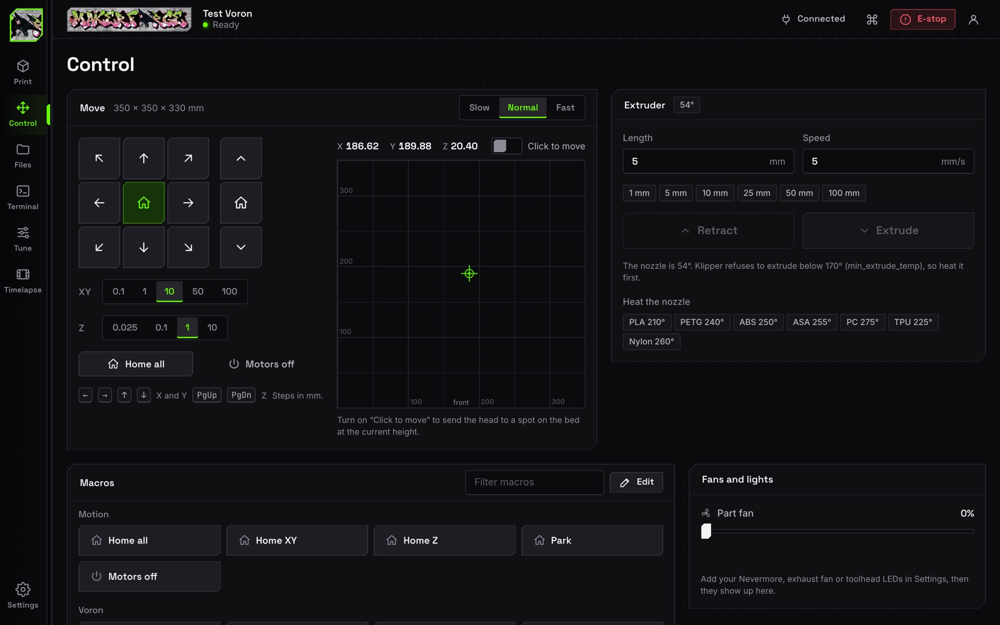 | 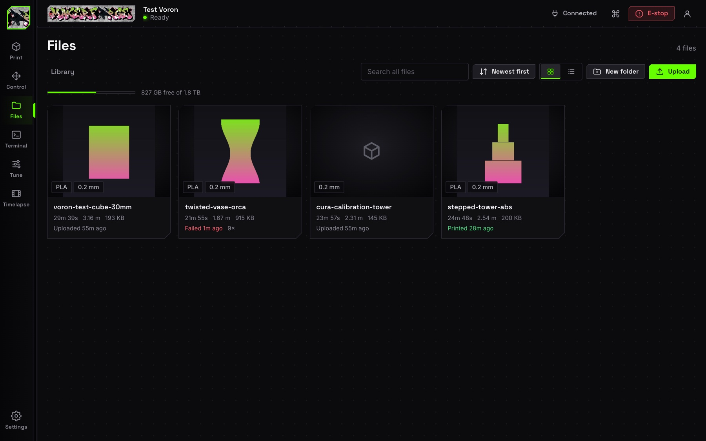 |
| **Control**: jog pad, bed map, extruder, macros | **Files**: thumbnails, estimates, history |
| 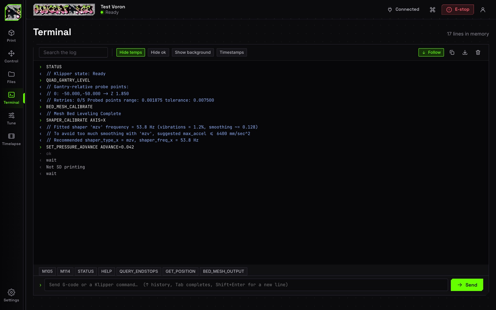 | 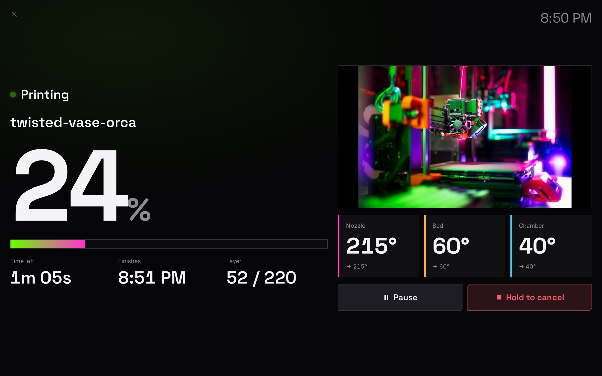 |
| **Terminal**: Klipper-aware colours and autocomplete | **Kiosk**: for a screen mounted at the printer |
| 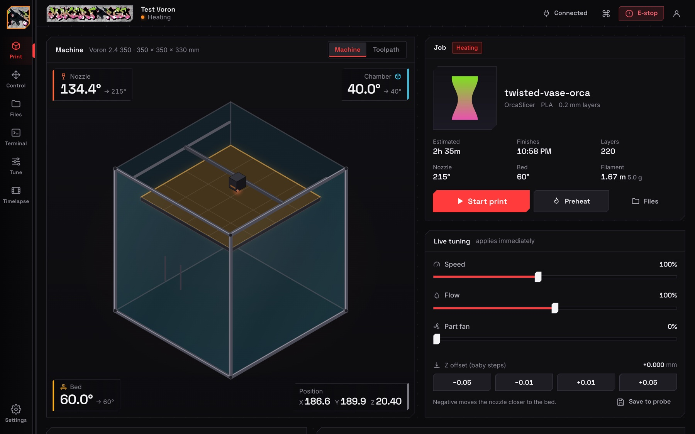 | 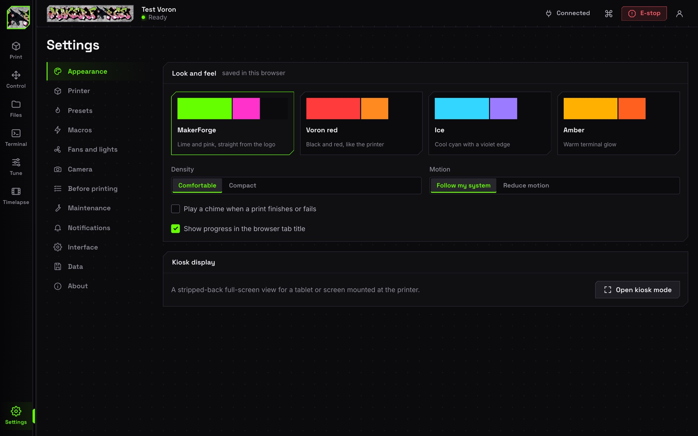 |
| **Voron red** theme | **Settings**: themes, macros, presets, camera, notifications |

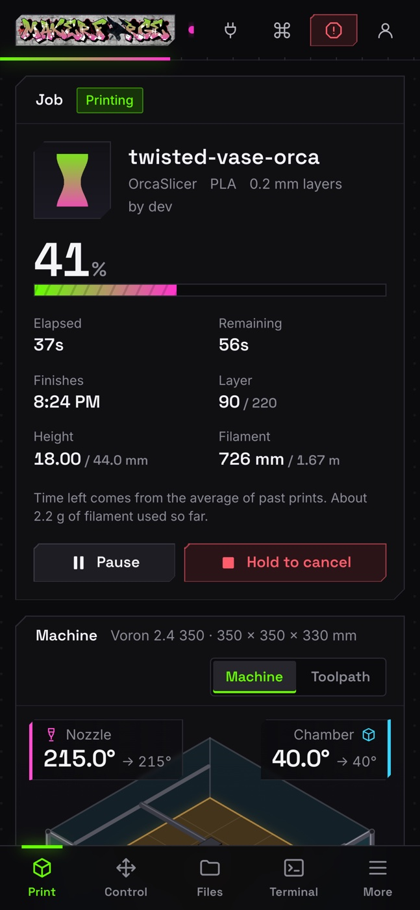

On a phone the rail becomes a tab bar and every control grows to a thumb-sized target.

## Install

In OctoPrint: **Settings > Plugin Manager > Get More… > "... from URL"**, paste

```
https://github.com/28kearlrusa-spec/Octoprint/archive/refs/heads/main.zip
```

click **Install**, then restart OctoPrint when asked. Open your printer's address as usual. You'll land on the MakerForge sign-in.

From a shell instead (inside OctoPrint's virtualenv, for example `~/oprint/bin/pip` on OctoPi):

```bash
~/oprint/bin/pip install https://github.com/28kearlrusa-spec/Octoprint/archive/refs/heads/main.zip
sudo systemctl restart octoprint
```

### Getting the classic UI back

Nothing is lost. Any time:
- add **`?classic`** to the address (for example `http://your-printer/?classic`), or
- use *Classic OctoPrint UI* in the account menu, or
- untick **Settings > MakerForge UI > Use the MakerForge UI as the main page** in the classic Settings dialog.

The MakerForge UI also stays at `/plugin/makerforge/`, and there is a **MakerForge UI** link in the classic navbar.

## First run with Klipper

1. **Connect**: with OctoKlipper or the Klipper serial bridge the port is usually `/tmp/printer`. The UI picks it for you when it's there.
2. The UI sends `M115`, `STATUS` and `HELP` after you connect (quietly, hidden from the terminal) to learn which commands your Klipper config actually has, and greys out macros and tools it doesn't support.
3. Open **Settings > Camera** if your stream isn't picked up from OctoPrint's own camera settings, and **Settings > Fans and lights** to add your Nevermore or Stealthburner LED names.
4. Add the macros you like in **Control > Macros > Edit**. Macros are plain G-code, can take prompts (`{temp|60}`), and can require a hot nozzle or a Klipper command.

### Klipper tips that make the UI better

- **Chamber temperature**: OctoPrint only sees sensors that Klipper reports in `M105`. Add `gcode_id: C` to your `[temperature_sensor chamber]` and the chamber shows up on the schematic, in the tiles and on the chart.
- **Macro prompts** need `[respond]` in `printer.cfg` (most Voron configs have it). A macro then asks like this, and each button runs its own G-code:
  ```
  RESPOND TYPE=command MSG="action:prompt_begin Filament runout"
  RESPOND TYPE=command MSG="action:prompt_text Load new filament, then resume."
  RESPOND TYPE=command MSG="action:prompt_footer_button Cancel print|CANCEL_PRINT|error"
  RESPOND TYPE=command MSG="action:prompt_footer_button Resume|RESUME|primary"
  RESPOND TYPE=command MSG="action:prompt_show"
  ```
  The macro that handles the answer closes it with `RESPOND TYPE=command MSG="action:prompt_end"`. Closing the dialog yourself sends the same line, so every open screen closes it too.
- **Klipper shutdowns**: when Klipper stops (lost MCU, heater fault, thermal runaway) a red bar appears on every screen with the reason and a one-click **Firmware restart**. After a restart the UI reconnects the serial port for you.
- **OctoKlipper**: if it's installed, *Tune > Klipper > Edit printer.cfg* opens its config editor.

### Voron macros it understands (all optional)

`QUAD_GANTRY_LEVEL`, `Z_TILT_ADJUST`, `BED_MESH_CALIBRATE`, `CLEAN_NOZZLE`, `LOAD_FILAMENT`, `UNLOAD_FILAMENT`, plus everything built into Klipper (`PROBE_CALIBRATE`, `SHAPER_CALIBRATE`, `PID_CALIBRATE`, `TUNING_TOWER`, `SET_LED`, `SET_FAN_SPEED` ...).

## Notes for tinkerers

- **No build step.** The front end is plain ES modules loaded through an import map whose URLs carry content hashes, so updates never get stuck in a stale cache.
- **Safe by design.** The layer scan runs as a separate, low-priority process so it can never starve Klipper on a small computer. The shell contains nothing user-specific. Every API route enforces OctoPrint's own permissions. Path handling refuses anything outside the uploads folder. Webhook URLs are readable by admins only.
- **Data lives in OctoPrint's plugin data folder** (`config.json`, `stats.json`, caches). Delete the folder to reset.
- The plugin registers no printer commands of its own: everything goes through OctoPrint's normal API, so it all shows up in the terminal and logs.

### Developing

```bash
dev/dev-instance.sh setup     # venv + OctoPrint + this plugin + a throwaway test user
dev/dev-instance.sh bg        # http://127.0.0.1:5055, with OctoPrint's virtual printer
dev/fixture.sh connect        # connect the virtual printer with a Voron-sized profile
dev/fixture.sh print voron-test-cube-30mm.gcode
python3 dev/make_samples.py   # sample G-code with thumbnails
```

Tests:

```bash
python3 -m unittest discover -s tests -v      # G-code metadata, layer scan, stats, notifications
node tests/klipper.test.mjs                    # Klipper output parsers, using Klipper's own message formats
node tests/prompts.test.mjs                    # macro prompts (Mainsail's action:prompt_* protocol)
node tests/worker.test.mjs                     # the toolpath parser
```

(macOS: port 5000 belongs to AirPlay, which answers with random 403s. The scripts use 5055 for that reason.)

## Credits

Fonts: Space Grotesk, Inter and JetBrains Mono under the SIL Open Font License 1.1. Logo and brand colours: MakerForge. Built to sit on top of [OctoPrint](https://octoprint.org) (AGPLv3).

Licensed AGPLv3, like OctoPrint itself.
